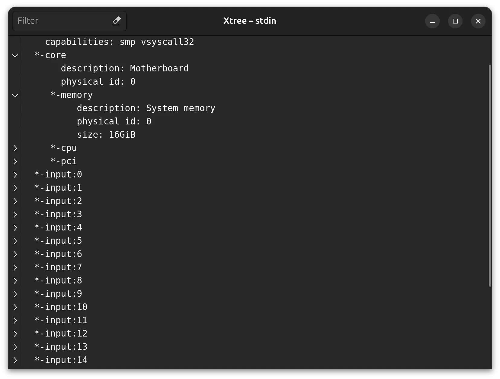

# Xtree

Display text as expandable tree

<p align="center">
  
</p>

I created this to make it easier (for human) to read tree-like output of a
program, such as `gradle`, `lshw`, and `lsblk`, by displaying it along with
expand-collapse buttons.

The idea was to make a single-file program. That's why the source code is the
program and the program is the only source code.

## Usage

Usage example:

```sh
# Display help.
./xtree -h

# Gradle dependencyInsight.
./gradlew app:dependencyInsight --configuration releaseRuntimeClasspath \
  --dependency androidx.compose.material:material | <XTREE_DIR>/xtree

# Other uses.
lshw | ./xtree
lsblk | ./xtree
```

## Requirements

This program needs Python 3, PyGObject, and GTK 4.0. If you use the recent
version of GNOME, you probably have already had these. Otherwise, see
[the installation instruction](https://pygobject.gnome.org/getting_started.html).

